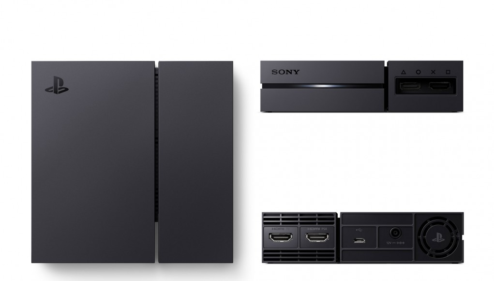
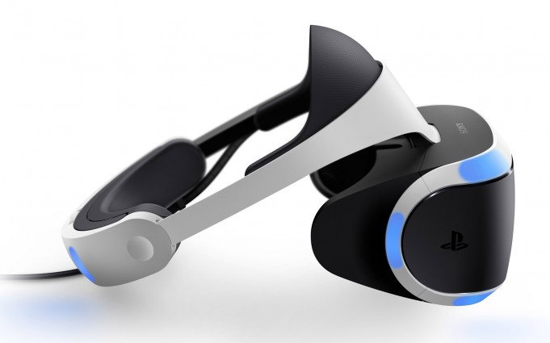

# psvr-protocol

Breakdown of the PlayStation VR communication protocols for programmers.

# The parts

The PSVR comes with two main components - the actual headset, and a small
processing unit that handles most of the logic. These two parts are required -
the headset cannot function without the box.

## The processing unit

This device sits in-between the headset and the computer.

The processing unit has multiple IO connections

* On the back
  * A USB connection to a PlayStation or computer
      * This is used by the computer to control the headset, give
        orientation sensor readouts, send audio, read Mic data, and more
  * A HDMI video input that drives the video in the headset itself,
    labelled **"HDMI _PS4_"**
  * An optional HDMI video output that goes to an external TV,
    called the social screen as this is what the people around you see - labelled **"HDMI _TV_"**
* On the front
  * A HDMI video output that goes directly to the headset
  * A proprietary (AFACT) connector that goes directly to the headset
      * This is used internally by the processing unit for things like
        retrieving inertia sensor readouts

## The headset

Properties

| Property                              | Value
|---------------------------------------|----------
| Full resolution                       | 1080p (1920x1080)
| Per-eye resolution                    | 960x1080 (screen divided in half widthwise per eye)
| Color mode                            | RGB [4:4:4][chroma_subsampling_wiki]
| [Inertial measurement unit][imu_wiki] | [BMI055][imu datasheet] (6 degrees of freedom)
| Lens to lens distance                 | 63.1mm
| Lens center to viewer baseline        | 39.48mm
| Screen to lens distance               | 35.4mm
| Distortion factors (K1 & K2)          | 0.22, 0.24

Credit to [Agustín Bernad](https://gitub.com/gusmanb) on GitHub for calculating the lens properties [here](https://github.com/gusmanb/PSVRFramework/issues/27).

[imu_wiki]: https://en.wikipedia.org/wiki/Inertial_measurement_unit
[imu datasheet]: https://www.bosch-sensortec.com/bst/products/all_products/bmi055
[chroma_subsampling_wiki]: https://en.wikipedia.org/wiki/Chroma_subsampling

# The basics

There are two connections that need to be established.

First, a USB connection must be made with the PSVR processing unit.
The processing unit itself acts as a [USB HID](https://en.wikipedia.org/wiki/USB_human_interface_device_class) device to the host computer.

The PSVR will not display any video unless the correct initialisation
commands are sent via USB.

Some projects (such as the [MacMorpheus video player][MacMorpheus]) avoid all
USB communication by having an powered-on, idle PS4 connected to the processing
unit via USB. This sucks because it is a pain having a PlayStation hooked up
to your system. This setup also can only be used in [cinematic mode][cinematic mode]

[MacMorpheus]: https://github.com/emoRaivis/MacMorpheus

[cinematic mode]: modes/cinematic.md

